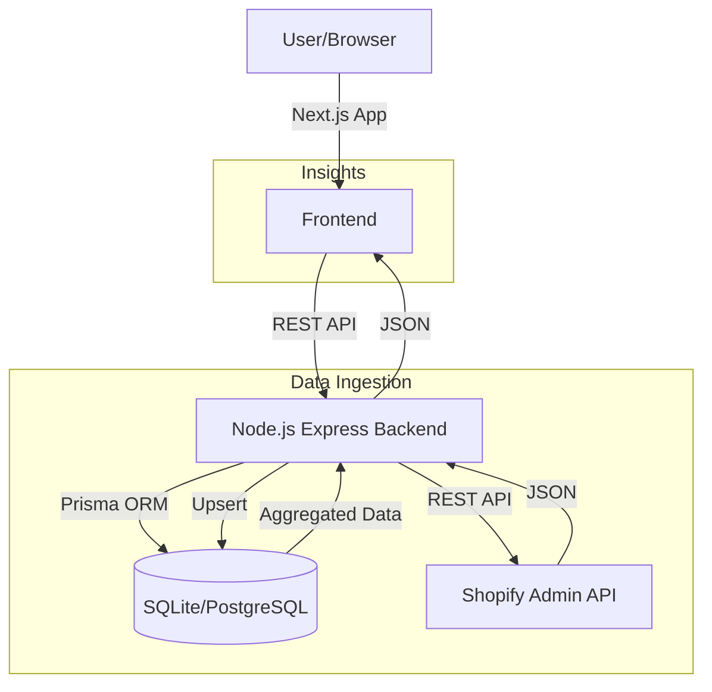

# Shopify Data Ingestion & Insights Service - Documentation

## Assumptions
1.  **Single Region**: The service is deployed in a single region.
2.  **Data Volume**: The current architecture assumes moderate data volume suitable for a single RDBMS instance. For high scale, sharding or a data warehouse (Snowflake/BigQuery) would be needed.
3.  **Shopify API Limits**: We assume standard Shopify API rate limits. The current implementation does not handle complex rate limiting backoff strategies (though `shopify-api-node` or custom logic could add this).
4.  **Security**: Basic tenant isolation is implemented via `x-tenant-id`. In production, this should be replaced with JWT authentication and proper session management.
5.  **Sync Frequency**: Sync is triggered manually. In production, webhooks (topics: `orders/create`, `products/update`) would be the primary ingestion method.

## High-Level Architecture

## Data Models

### Tenant
- `id`: UUID (Internal Tenant ID)
- `shopifyDomain`: Shopify Store Domain
- `accessToken`: Admin API Access Token

### Product
- `id`: Shopify Product ID
- `title`: Product Name
- `price`: Price
- `tenantId`: Foreign Key to Tenant

### Order
- `id`: Shopify Order ID
- `total`: Total Price
- `currency`: Currency Code
- `customerId`: Link to Customer
- `tenantId`: Foreign Key to Tenant

### Customer
- `id`: Shopify Customer ID
- `email`: Customer Email
- `totalSpent`: Lifetime Value
- `tenantId`: Foreign Key to Tenant

## Next Steps to Productionize
1.  **Database**: Switch from SQLite to PostgreSQL (change `provider` in `schema.prisma`).
2.  **Queue System**: Implement Redis/BullMQ for background ingestion jobs to handle large data syncs without blocking the API.
3.  **Webhooks**: Register Shopify webhooks to receive real-time updates instead of polling.
4.  **Authentication**: Implement OAuth 2.0 for "Login with Shopify" and JWT for API security.
5.  **Testing**: Add unit tests (Jest) and integration tests (Supertest).
6.  **CI/CD**: Setup GitHub Actions for automated testing and deployment.
